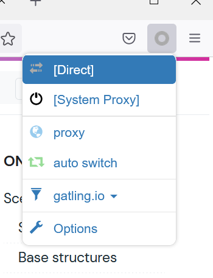
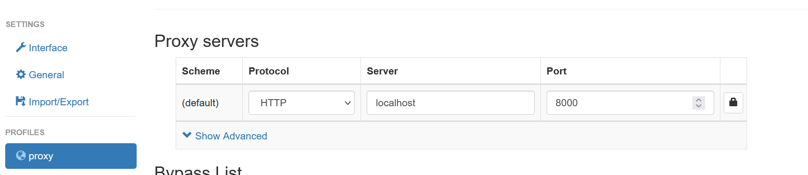
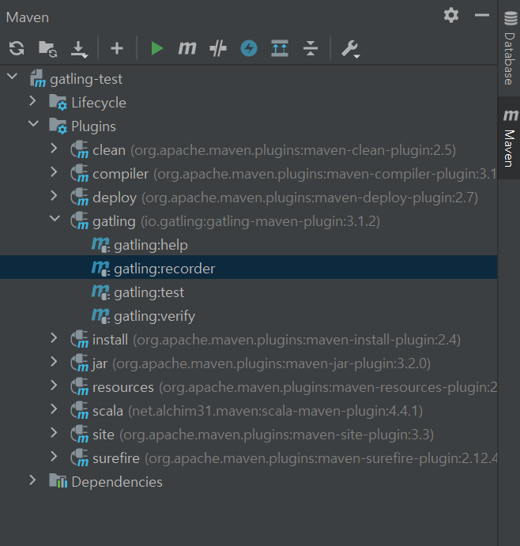
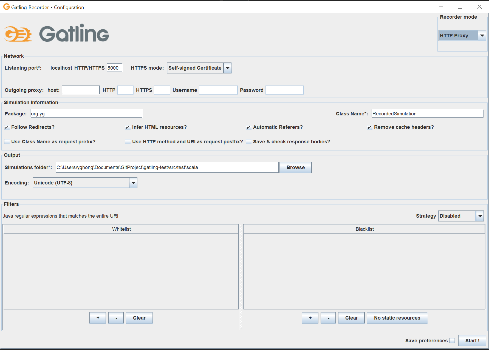
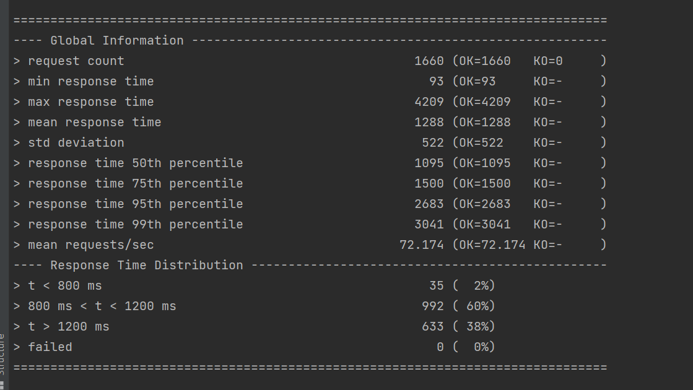
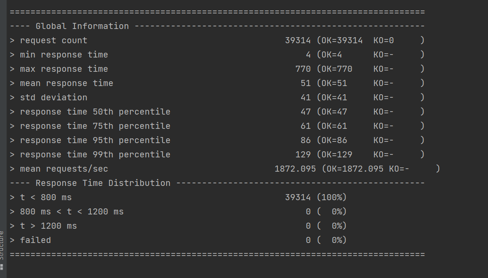
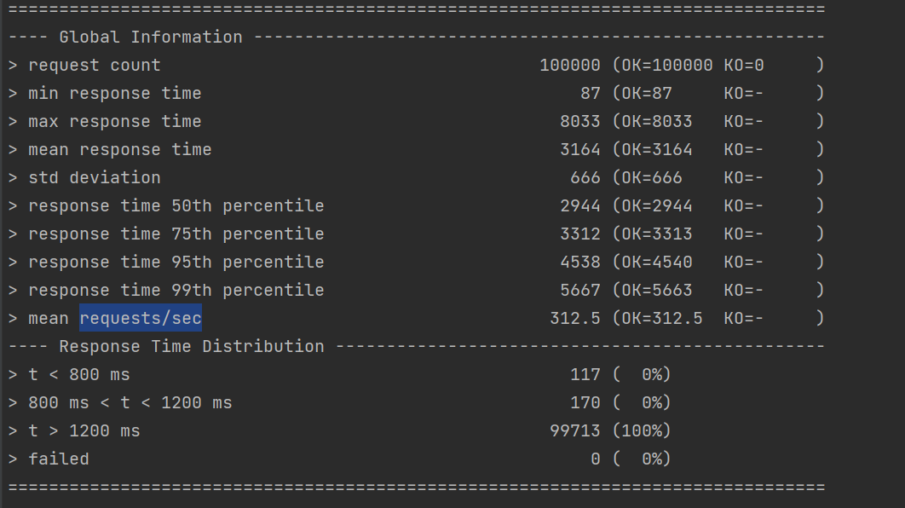

# Gatling

## Ref 
1. [test 설정](https://gatling.io/docs/gatling/reference/current/cheat-sheet/#injection-profile-open-injection-steps)

## 실행 방법
src.main.scala 는 동작 안함 ... 

### Record

브라우져의 http request를 gatling recorder 가 받아서 이를 Test 코드로 만들 수 있다.  

1. firefox 에 SwitchyOmega extension 설치

2. Proxy Tab 에 아래와 같이 입력 -> 브라우저의 http request 가 gatling recorder 를 거쳐서 나가게 된다.  

3. SwitchyOmega 모드를 Proxy로 변경 (Test 후에는 direct 로 바꾼다. 그렇지 않으면 인터넷이 안됨 )
4. mvn gatling:recorder 실행 안되면 아래와 같이 

5.아래 화면에서 **No static Resources** 를 누른 뒤 Start 누른 고 firefox 에서 원하는 API 로 request 

6. test.org.yg 에 RecordedSimulation 으로 파일이 저장됨 

### Run
mvn gatling:test
mvn gatling:test -D gatling.simulationClass=org.yg.TrainerCreate

### 결과 확인 
terminal 에 결과 표시 

1. 해석 방법 

## Test 결과
> response time 50th percentile                        286 (OK=286    KO=-     )
>>50 Percent의 Response Time 이 286ms 보다 작다 즉 빠르다.

- 1차 (500 동시 100번 반복)
  - webflux
    - 328.947
  - mvc
    - 273.224
- 2차 (500 동시 100번 반복)
  - webflux
    - 1315 DUMMY, webflux 로그 없앰 

### myslq vs redis 
- Intel(R) Core(TM) i7-7700 CPU @ 3.60GHz   3.60 GHz 4코어/ 16gb
- Redis, MySql: CPU 2 / Memory 2048 / Docker
- Dummy: Memory 2048
- 20 초 100명

#### 쓰기 
- my sql

- redis 

### proxy-trainer
1. 1차 webflux

## 주의 
Gatling 3.x 대는 Scala 2.13 을 이용한다. 